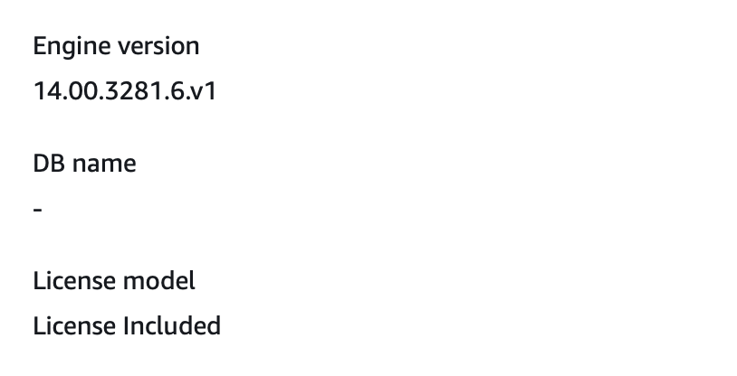

# sql-server-AWS-setup-guide-
A collection of tips I learned the hard way to successfully connecting to a Sql Server instance using Python

I recently went through the experience of setting up and connecting to a sql server database instance hosted by Amazon Web Service’ Relational Database Service. While the actual instance setup via the AWS dashboard was fairly straightforward, connecting to it via Python was less so and I ended up running into several pitfalls along the way. It is my intention to therefore document those pitfalls and how I got past them here in one place in the hopes that this may save someone else some headache in the future. 

## Setup

The first step to creating a usable database is the actual instantiation of the database server that can be used by whatever user base will actually be making queries at the end of this process. Amazon has a fairly easy to use dashboard system set up to do this, but there are a couple of things to keep in mind when going through this process. 

For my instance I used the free tier of services, which meant using SQL Server Express Edition. I was able to do this because the needs dictated by my use case were not extravagant enough to require anything beyond what the basic tier provided. 

For billing purposes I will note that the free tier instance does allot up to 750 hours of uptime per month; which basically entails having one instance up and running for the entire month 24/7. If you plan on using more than one database instance, even at the free tier, you will be charged if you keep one running for the entire month and instantiate additional instances. While the rate per hour after this limit is less than a cent per hour, if your needs allow for database downtime, a good way to save unnecessary billing is to take a snapshot of your instance before deactivating it between use periods and then firing up a new instance from the snapshot when needed. This allows you to recreate the original database from the copy without having to rebuild any tables or reinsert any data contained therein. 

During instantiation, for the most part, I accepted the default options. There are a couple of things to note here. I did use the default subnet, which is the default VPC that Amazon provides you with when you start an AWS account, however I did create a custom security group specifically for SQL database hosting. If you do not do this, you will have to make the following modifications to your existing security group. First make sure that port 1433 is open in inbound settings; this is the port that SQL Server specifically uses, other iterations of SQL use different ports (Postgresql uses port 5432 for example), but without this open you will not be able to access your server. Also if you want to make your server accessible to others, make sure that your inbound TCP rules include permissions for sources 0.0.0.0/0 and ::/0, otherwise the default permission is specific to your address which just allows you to access it outside of your virtual private cloud. This gives your server permission to receive requests from anyone who has the proper credentials. Which brings me to the second change that I made, which was to allow public access. This fit my use case as I wanted to share access with specific users, and for me it was easier to provide those users with the proper username, password and address to the server than to set up access to my vpc network through IAM roles, however this may be a step to look into if your use case entails providing access to many users within your organization at different points in time. 

The last thing to note here during the instantiation process is to make sure you save your master username, master password and database instance name; without these you will not be able to connect to your instance and as the process will remind you, there is no way to go back and get this information later beyond a certain point. 

## Connecting to Your Database

Now that the easy part is over the next step is connecting to the database with Python in a Jupyter Notebook. There are several programs to do this, I ended up using pyodbc and pymssql. Pyodbc reportedly has more user friendly error messages when something goes wrong, but if you’re using a mac, as I am, the installation process is much more complicated due to issues with the driver needed to connect to the database. For pymssql a simple pip install of this program is enough on a windows machine with an additional brew installation of the freetds driver if connecting from a mac. 

One notable issue that I and others before me have run into can come when incorporating the database name into the connection string. If connecting to your database instance for the first time, do not include this field into your string as the database instance is instantiated without a database name within it to connect to, unlike with the Postgresql alternative. This can be verified by selecting the database in question from the AWS RDS databases list and looking at instance configuration under the left hand side of the Configuration tab, as shown below. 

This means that with programs like the sql plugins for VS Code in which the database name is a required field, connection isn’t even possible when connecting for the first time. Fortunately, with most connection string formats in python, the field “dbname = “ can simply be excluded from the string altogether to successfully connect prior to setting up a database within the server instance for the first time. Thus the following example connection strings with pymssql and pyodbc respectively, should work. 

    conn = pymssql.connect(host='endpoint_address',user='******',password='********')

	conn = pyodbc.connect(host='endpoint_address ', port = 1433, UID = "******", PWD="********",DRIVER='ODBC Driver 17 for SQL Server')

Once you have connected and created a database within the server instance, the field database=' ' can be added to this string filled with the name that you choose to attribute to your database. 

## Database Creation

Unless you are instantiating the server from a snapshot of a previously created database, you will have to create a database within the server instance with whatever tables and data you wish to utilize before having a ready for use product for a given use case. This task can also be somewhat tricky, depending on your software setup. If you are using a windows environment the easiest way to do this is to simply install Microsoft’s free to use default program for interacting with a SQL Server database; SQL Server Management Studio. If however, like me, you are working with another operating system which is not supported by this program you are left with a number of alternative option.

The first of which would be to turn again to AWS and fire up an ec2 instance with a windows operating system installed and then download Management Studio and utilize it from there. 

A second approach which was my first choice, is to utilize a python plugin called sql alchemy which has a very useful command called PERSIST, which allows for the export of a pandas dataframe object directly to a table within the database. Unfortunately for me sql alchemy relies on pyodbc for its connection string; while I was with effort able to connect with pyodbc, I was not able to get the specific connection string format used by sql alchemy to work properly. At such a time when I do, this guide will be updated to reflect the necessary procedure.  

Another alternative is to use a non-code based third party program which emulates Management Studio. There are several such programs available; I used SQLPro for mssql. This program was fairly user friendly, and although there is a subscription version, the free to use version was sufficient to do everything that I needed to for database and table creation. The downside of this approach of course is that being a gui based program it may not offer the ability to automate any kind of updates that need to be written to tables.  

Once a method of database and table creation is decided upon, there is one more common issue that can come up. Once I got to the point, I encountered a write permission error, wherein the database failed to recognize me as having the master privileges needed to write a database into the instance despite logging in with the master username and password credentials that I instantiated my instance with. If encountered this error does have a relatively easy fix; simply log back into the RDS dashboard within AWS, select the database and select the option to modify it. From here resetting the master password will restore the master privileges needed to write to the instance. If for whatever the reason you don’t wish to change the password itself at this point, resetting the new password as the same as the old one will be enough to fix the issue. There may be a minimal downtime on the instance while the change takes effect, but I found that this was negligible as long as the password is the only modification being implemented. 
